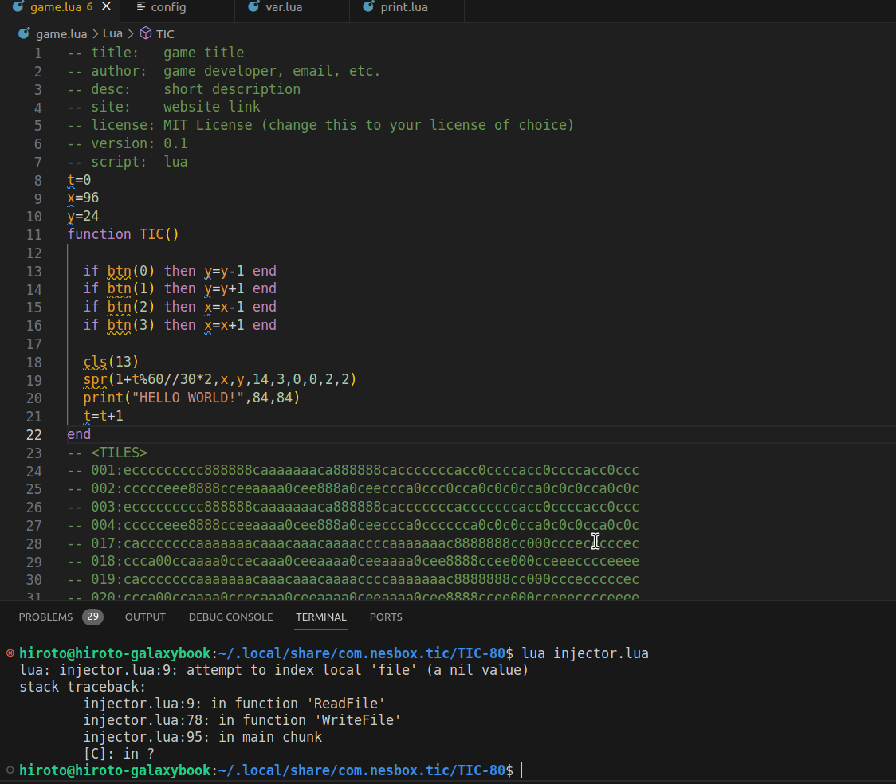

# tic80-injection

Inject code into TIC80 carts.

## How it works

You need a TIC80 cart that was exported into lua.
That can be done with the command `export [NAME].lua`, where `[NAME]` is replaced by the name of your project.

The injector takes in a `config` file of the format:

```txt
target:cart
in:f1,f2
```

`cart` contains the TIC80 cart proper (the one that was exported by the TIC80 cmd).

Files that are to be inserted into the TIC80 `cart` are listed separated by commas in the `config` file. In this example, we are inserting `f1` and `f2`.

Note that these files are inserted in the order that they show up on `config`.

## Example

`config`

```txt
target:game
in:var,print
```

---

`var.lua`

```lua
hello = 'Hello, World!'
```

---

`print.lua`

```lua
print(hello)
```

---

After running `lua injector.lua`, the following will be written to `game.lua`:

```lua
... -- (Headers)
-- script:  lua
hello = 'Hello, World!'
print(hello)
-- <TILES>
... -- (Cart data)
```


